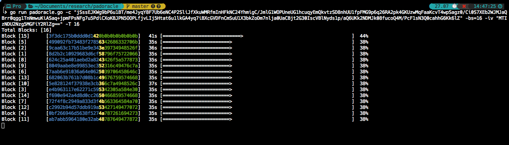
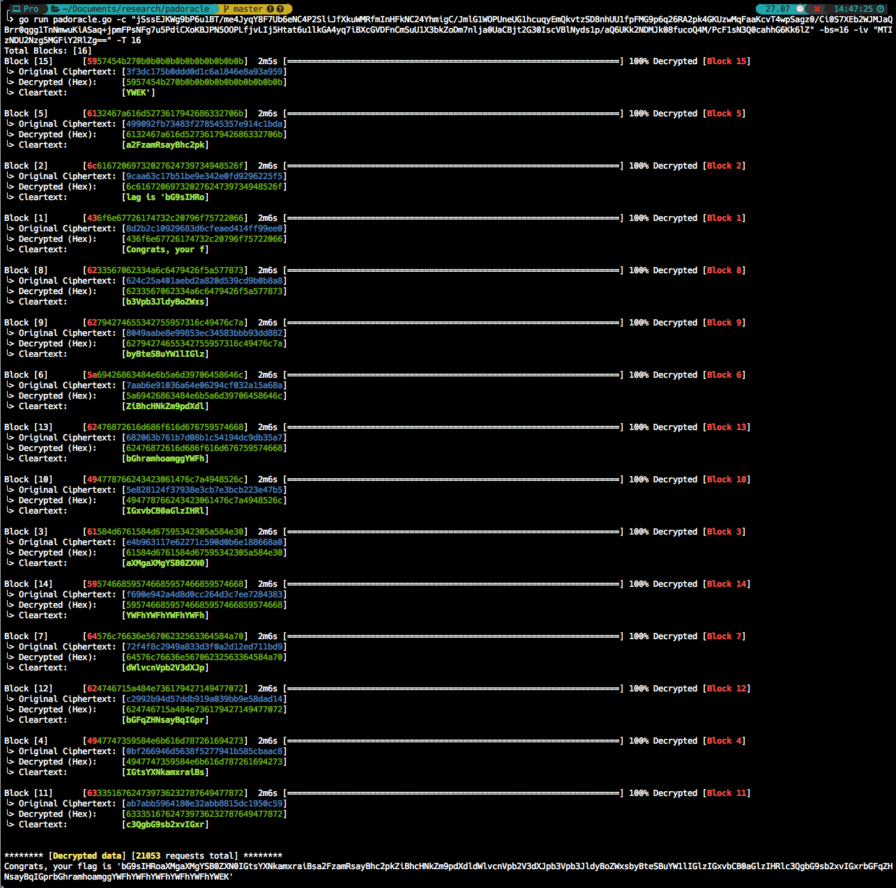

# padoracle
An extensible, high-performance framework for exploiting padding oracles in network-based applications.

## Background
A padding oracle occurs in a cryptosystem where the application (the oracle) reveals information about the legitimacy of padded ciphertext. This typically happens in cipher block chaining (CBC) mode.

### CBC Mode and Padding
In CBC mode, the initialization vector (IV) is typically the first block of the ciphertext. For subsequent blocks, the ciphertext of the preceding block acts as the IV for the current block. 

Because block ciphers require equal-length plaintext blocks, the final block of plaintext must be padded to meet the required block size. Common padding standards like PKCS5 and PKCS7 are virtually identical, except PKCS5 is standardized for 8-byte blocks, whereas PKCS7 works for any block size up to 255 bytes. Both use the value of the padding bytes to denote the number of padding bytes added. 

For example, given the cleartext `AAAA`, and a block size of 8, it must be padded with 4 bytes of `\x04`: `AAAA\x04\x04\x04\x04`. When the application decrypts the block, it looks at the final byte (`\x04`) and expects the last 4 bytes to all be `\x04`.

### The Attack
The padding oracle attack exploits two facts:
1. The preceding ciphertext block acts as the IV for the current block during decryption.
2. The application leaks whether the padding is valid or invalid (e.g., through HTTP 500 errors, distinct error messages, or timing differences).

By systematically mutating the preceding ciphertext block (the IV) and sending it to the application, an attacker can observe the application's response to determine if the tampered block resulted in valid PKCS7 padding. By iterating through all possible byte values (0-255) for each byte in the block, the attacker can decrypt the entire ciphertext without ever knowing the encryption key. They can also use this technique to forge new encrypted payloads.

## Quick Start Demonstrations

To see `padoracle` in action immediately, you can use the included vulnerable servers in the `examples/` directory.

### 1. HTTP Padding Oracle (AES-CBC)

This server hosts a vulnerable endpoint that leaks padding errors via HTTP 500 status codes.

1. **Start the vulnerable server:**
   ```bash
   go run examples/vuln_http_server.go -p 8080
   ```
   The server will output a sample ciphertext.

2. **Run `padoracle` to decrypt:**
   In another terminal, use the provided ciphertext:
   ```bash
   go run padoracle.go -u "http://127.0.0.1:8080/?vuln=<PADME>" -c "<PASTE_CIPHERTEXT_HERE>" -bs 16
   ```

### 2. TCP Padding Oracle (Custom Protocol)

This server demonstrates a non-HTTP padding oracle that communicates over raw TCP and leaks errors through a specific string (`PADDING_ERROR`).

1. **Start the TCP server:**
   ```bash
   go run examples/vuln_tcp_server.go -p 9000
   ```

2. **Modify `padoracle.go` for TCP:**
   You would need to update `CallOracle` to use `net.Dial("tcp", ...)` and check for the `PADDING_ERROR` string. This is a great exercise to see how extensible the tool is!

## Why `padoracle`?

There are other padding oracle exploitation tools, but `padoracle` focuses on **speed** and **concurrency**.

- `padbuster`: A classic tool, but written in Perl and can be slow.
- `padding-oracle-attack`: A solid Python-based solution, but somewhat inflexible and processes blocks sequentially.

`padoracle` is *fast*. It is built in Go and aggressively parallelizes the attack. It decrypts each block independently and concurrently. It also parallelizes the byte-guessing process using safe and efficient goroutines, meaning it can fire off hundreds of asynchronous requests at once. On a test system, it can decrypt 16 blocks of 16-byte ciphertext in under 1.5 minutes (using 100 threads).

## Usage
`padoracle` is highly extensible, but it requires minor code modifications to teach it how to talk to your specific target.

First, clone the repository:

```bash
git clone https://github.com/swarley7/padoracle.git
cd padoracle
```

### Configuring the Oracle
To adapt the tool to your target application, open `padoracle.go` in your favorite editor. You will need to modify the `testpad` struct's methods to suit your needs:

1. **`EncodePayload`**: Define how the raw byte payload should be encoded before sending it (e.g., Base64, Hex).
2. **`DecodeCiphertextPayload`**: Define how the input ciphertext from the CLI should be decoded into raw bytes.
3. **`CallOracle`**: Implement the HTTP request (or any protocol) that sends the payload to the target.
4. **`CheckResponse`**: Analyze the HTTP response (status code, body text, etc.) to determine if the padding was valid (`true`) or invalid (`false`).

Once modified, build the tool:

```bash
go build
```

Then run it against your target:

```bash
./padoracle -u "http://target.com/vuln?data=<PADME>" -c "YOUR_ENCODED_CIPHERTEXT" -bs 16 -T 100
```

Use the `-h` flag to see all available options (such as `-m 1` for encryption mode).

## Examples




## Credits
Built as an exercise in lateral thinking and Go concurrency. 
